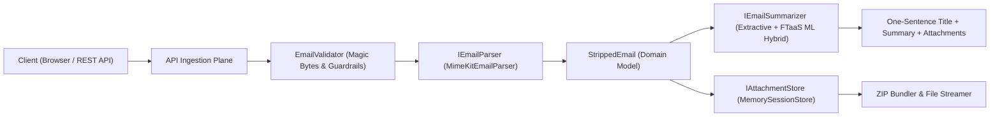

# mailStripper ✉️✨

> *Pronounced just like **"male stripper"** /meɪl ˈstrɪp.ər/ — strips emails down to the bare essentials.*

A high-performance **.NET 10** utility and API ingestion plane built upon Jeffrey Stedfast's industry-standard [`MimeKit`](https://github.com/jstedfast/MimeKit) library.

`mailStripper` provides:
1. **API Ingestion Plane**: Ingest `.eml` files (multipart form upload) or raw pasted RFC 822 / email snippets.
2. **One-Sentence Title**: Synthesizes the sender's core intent or request into a punchy single sentence headline.
3. **Short Summary**: Distills actionable items, deadlines, key updates, and attachment details without signature clutter, legal disclaimers, or reply quoting chains.
4. **Instant Attachment Extraction**: Inspect file categories (Spreadsheets, PDFs, Images, Code, Archives), download files individually, preview inline, or download all attachments in a single **`.ZIP` bundle** with one click.
5. **🛡️ 100% Local-Only & Air-Gapped Proof**: Provable zero external network egress, zero disk leakage, and zero telemetry.
6. **Polyglot ML Integration**: Operates out-of-the-box with a high-speed, zero-dependency extractive summarizer, and automatically connects to the local FTaaS ML inference endpoint (`SmolLM2-135M` / `TinyLlama-1.1B`) when available in the `../ml` directory.

---

## 📺 Interactive Video Demonstration

Watch the complete end-to-end automated demonstration in action—from privacy proof inspection and guardrail validation to sample email extraction, inline previews, and raw text ingestion:

> **Recorded Demonstration**: [demo.mp4](demo.mp4) *(High-definition Playwright automated recording, 35s, 1366x860)*
>
> To regenerate this demonstration at any time, run: `./scripts/record-demo.sh`

---

## 🛡️ Provable Local-Only & Air-Gapped Architecture

`mailStripper` doesn't just claim privacy — it proves it architecturally and cryptographically:

1. **Zero External Egress (Hard CSP)**:
   All HTTP responses enforce a strict Content Security Policy (`default-src 'self'; connect-src 'self' http://localhost:8000; font-src 'self'; object-src 'none'`). The browser kernel actively blocks any outbound network calls to external domains.
2. **Zero Disk Storage (Volatile RAM Only)**:
   Emails and extracted attachments are never saved to temporary disk folders or cached files. Streams are decoded in volatile memory (`MemoryStream` / `ConcurrentDictionary` with sliding TTL).
3. **Zero Telemetry / Self-Contained Assets**:
   Zero Google Analytics, tracking pixels, or remote telemetry. Remote CDN fonts have been completely replaced with native system font stacks (`-apple-system`, `BlinkMacSystemFont`, `JetBrains Mono`) for 100% offline air-gapped isolation.
4. **Live Cryptographic Proof Endpoint**:
   Query `GET /api/strip/privacy-audit` at any time to inspect active socket endpoints, zero disk leakage status, and the SHA-256 system audit fingerprint. Or click the **"🛡️ 100% Local-Only"** badge in the UI.

---

## 🚀 Quickstart

### Prerequisites
- [.NET 10 SDK](https://dotnet.microsoft.com/download) installed.
- (Optional) [Node.js](https://nodejs.org) to run Playwright E2E tests and video recordings.

### Run Locally
```bash
dotnet run --project MailStripper/MailStripper.csproj --urls "http://localhost:5001"
```

Open your browser to: **[http://localhost:5001](http://localhost:5001)**

---

## 🎯 Architecture & SOLID Principles



### Core Services
- `EmailValidator`: Validates file extensions and inspects the first 1 KB of stream bytes for binary magic signatures (MP4, PNG, JPEG, PDF, ZIP, Mach-O/ELF). Rejects non-email files with diagnostic `HTTP 400` errors before parsing.
- `IEmailParser`: Uses `MimeKit.MimeParser` to traverse complex MIME trees, handling multipart/alternative, multipart/mixed, nested RFC 822 messages, and inline CID parts.
- `IEmailSummarizer`:
  - `ExtractiveEmailSummarizer`: Subject prefix cleaning (e.g. `Re:`, `Fwd:`, `[SEC=OFFICIAL]`), quote removal (`> ...`), greetings/sign-offs stripping, and salience-scored intent formulation.
  - `MlHybridSummarizer`: Checks local FTaaS inference server (`http://localhost:8000/api/v1/inference/generate`) for compact on-device LLM generation, with instantaneous fallback to extractive mode if offline.
- `IAttachmentStore`: In-memory temporary cache with sliding expiration TTL and dynamic `System.IO.Compression.ZipArchive` generation for single-click `.zip` bundle downloads.
- `PrivacyAuditService`: Conducts live system socket inspections, verifying zero external connections and generating cryptographic audit hashes.

---

## 📡 API Ingestion Plane

### 1. Ingest `.eml` File
```http
POST /api/strip/file
Content-Type: multipart/form-data
```
**Form Field**: `file` (the `.eml`, `.msg`, or raw MIME message).

### 2. Ingest Raw Text / Headers
```http
POST /api/strip/text
Content-Type: application/json

{
  "content": "From: Sarah Connor <sarah@resistance.org>\nSubject: Mission Briefing\n\nPlease review the defensive coordinates for sector 4."
}
```

### 3. Download Attachment
```http
GET /api/strip/{sessionId}/attachments/{index}
```
Returns file stream with appropriate `Content-Disposition: attachment; filename="..."` and MIME type.

### 4. Download All Attachments as ZIP
```http
GET /api/strip/{sessionId}/attachments/download-all
```
Returns `application/zip` containing all extracted files with deduplicated, safe filenames.

### 5. Instant Demo Sample
```http
GET /api/strip/sample
```
Returns a rich pre-parsed enterprise email with attached CSV, security clearance TXT, and PNG diagram for 1-click evaluation.

### 6. Local-Only Privacy Audit
```http
GET /api/strip/privacy-audit
```
Returns live audit verification of loopback-only connections, zero disk leakage, active CSP headers, and SHA-256 fingerprint.

---

## 🧪 Testing

### 1. .NET Automated Unit Tests
Run the 19 xUnit tests covering RFC 822 parsing, subject cleaning, intent summarization, magic bytes validation, and air-gapped privacy guarantees:
```bash
dotnet test
```

### 2. Playwright E2E Tests
Run the browser automation test suite (5 tests covering privacy proof modals, sample loading, attachment previews, MP4 rejection guardrails, and raw text paste):
```bash
node tests/e2e/run-tests.js
```

### 3. Record Automated Demo Video
Regenerate `demo.mp4` via Playwright:
```bash
./scripts/record-demo.sh
```

---

## 🛡️ Credits & References
- Built on the solid foundation of [MimeKit](https://github.com/jstedfast/MimeKit) by Jeffrey Stedfast (`jstedfast`).
- Optional ML integration designed to work with `../ml` (`SmolLM2-135M`).
