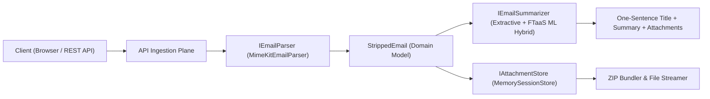

# mailStripper ✉️✨

> *Pronounced just like **"male stripper"** /meɪl ˈstrɪp.ər/ — strips emails down to the bare essentials.*

A high-performance **.NET 10** utility and API ingestion plane built upon Jeffrey Stedfast's industry-standard [`MimeKit`](https://github.com/jstedfast/MimeKit) library.

`mailStripper` provides:
1. **API Ingestion Plane**: Ingest `.eml` files (multipart form upload) or raw pasted RFC 822 / email snippets.
2. **One-Sentence Title**: Synthesizes the sender's core intent or request into a punchy single sentence as the headline.
3. **Short Summary**: Distills actionable items, deadlines, key updates, and attachment details without signature clutter, legal disclaimers, or reply quoting chains.
4. **Instant Attachment Extraction**: Inspect file categories (Spreadsheets, PDFs, Images, Code, Archives), download files individually, preview inline, or download all attachments in a single **`.ZIP` bundle** with one click.
5. **Polyglot ML Integration**: Operates out-of-the-box with a high-speed, zero-dependency extractive summarizer, and automatically connects to the local FTaaS ML inference endpoint (`SmolLM2-135M` / `TinyLlama-1.1B`) when available in the `../ml` directory.

---

## 🚀 Quickstart

### Prerequisites
- [.NET 10 SDK](https://dotnet.microsoft.com/download) installed.

### Run Locally
```bash
dotnet run --project MailStripper/MailStripper.csproj --urls "http://localhost:5001"
```

Open your browser to: **[http://localhost:5001](http://localhost:5001)**

---

## 🎯 Architecture & SOLID Principles



### Core Services
- `IEmailParser`: Uses `MimeKit.MimeParser` to traverse complex MIME trees, handling multipart/alternative, multipart/mixed, nested RFC 822 messages, and inline CID parts.
- `IEmailSummarizer`:
  - `ExtractiveEmailSummarizer`: Subject prefix cleaning (e.g. `Re:`, `Fwd:`, `[SEC=OFFICIAL]`), quote removal (`> ...`), greetings/sign-offs stripping, and salience-scored intent formulation.
  - `MlHybridSummarizer`: Checks local FTaaS inference server (`http://localhost:8000/api/v1/inference/generate`) for compact on-device LLM generation, with instantaneous fallback to extractive mode if offline.
- `IAttachmentStore`: In-memory temporary cache with sliding expiration TTL and dynamic `System.IO.Compression.ZipArchive` generation for single-click `.zip` bundle downloads.

---

## 📡 API Ingestion Plane

### 1. Ingest `.eml` File
```http
POST /api/strip/file
Content-Type: multipart/form-data
```
**Form Field**: `file` (the `.eml`, `.msg`, or raw MIME message).

**Response**:
```json
{
  "id": "f38568089ab0",
  "subject": "Q3 Distributed Pipeline Architecture & Budget Sign-Off",
  "from": "\"Cassian Brooks\" <cassian.brooks@vanguard-tech.io>",
  "oneSentenceTitle": "Cassian Brooks is requesting a review of the provided details and attached 3 files.",
  "shortSummary": "Please review the attached updated Q3 distributed pipeline architecture and the revised infrastructure budget breakdown...",
  "keyBulletPoints": [
    "Please review the attached updated Q3 distributed pipeline architecture...",
    "The security compliance sign-off document has been finalized and verified by InfoSec.",
    "Includes 3 attachment(s): q3_budget_breakdown.csv, security_compliance_signoff.txt, pipeline_architecture_diagram.png."
  ],
  "attachments": [
    {
      "index": 0,
      "fileName": "q3_budget_breakdown.csv",
      "contentType": "text/csv",
      "formattedSize": "265 B",
      "downloadUrl": "/api/strip/f38568089ab0/attachments/0",
      "previewUrl": "/api/strip/f38568089ab0/attachments/0/preview",
      "category": "spreadsheet"
    }
  ],
  "downloadAllZipUrl": "/api/strip/f38568089ab0/attachments/download-all"
}
```

### 2. Ingest Raw Text / Headers
```http
POST /api/strip/text
Content-Type: application/json

{
  "content": "From: Sarah Connor <sarah@resistance.org>\nSubject: Mission Briefing\n\nPlease review the defensive coordinates for sector 4."
}
```

### 3. Download Attachment
```http
GET /api/strip/{sessionId}/attachments/{index}
```
Returns file stream with appropriate `Content-Disposition: attachment; filename="..."` and MIME type.

### 4. Download All Attachments as ZIP
```http
GET /api/strip/{sessionId}/attachments/download-all
```
Returns `application/zip` containing all extracted files with deduplicated, safe filenames.

### 5. Instant Demo Sample
```http
GET /api/strip/sample
```
Returns a rich pre-parsed enterprise email with attached CSV, security clearance TXT, and PNG diagram for 1-click evaluation.

---

## 🧪 Automated Testing

Run the full xUnit test suite covering RFC 822 parsing, subject tag cleaning, intent extraction, attachment caching, and zip archiving:
```bash
dotnet test
```

---

## 🛡️ Credits & References
- Built on the solid foundation of [MimeKit](https://github.com/jstedfast/MimeKit) by Jeffrey Stedfast (`jstedfast`).
- Optional ML integration designed to work with `../ml` (`SmolLM2-135M`).
