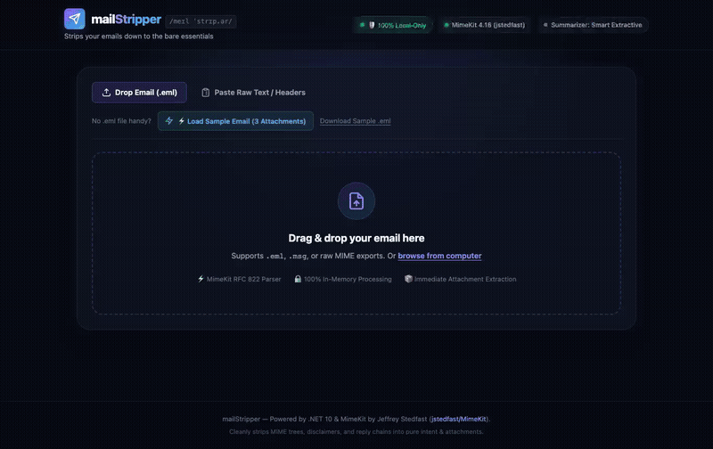

# mailStripper ✉️✨

> *Pronounced just like **"male stripper"** /meɪl ˈstrɪp.ər/ — strips emails down to the bare essentials.*

A high-performance, minimalist **.NET 10** email utility and ingestion plane built on Jeffrey Stedfast's industry-standard [`MimeKit`](https://github.com/jstedfast/MimeKit) library.

Drop an `.eml` email or paste text, and `mailStripper` instantly provides:
1. 🎯 **One-Sentence Title**: Synthesizes the core intent or request into a punchy single sentence.
2. 📝 **Short Summary**: Concise bullet points highlighting key dates, facts, and deliverables without reply chain clutter or legal disclaimers.
3. 📎 **Attachment Extraction**: Card gallery with file type categories, instant inline previews (images/text/CSV), and a single-click **"Download All as .ZIP"** bundle.
4. 🛡️ **100% Local-Only & Air-Gapped**: Proves zero external network egress (strict CSP), zero disk storage (volatile RAM only), and zero telemetry.
5. 🤖 **Optional ML Integration**: Works 100% standalone out-of-the-box with high-speed extractive summarization, and seamlessly pairs with the public [`event-driven-ftaas`](https://github.com/knowthankyew/event-driven-ftaas) microservice (`SmolLM2-135M` on `http://localhost:8000`) for generative understanding when available.

---

## 🚀 Quickstart (Zero-Coder "Just Works")

Clone the repository and run one command:

```bash
./start.sh
```

`start.sh` automatically launches the server and opens your browser directly to **[http://localhost:5001](http://localhost:5001)**. 

*(Prerequisite: [.NET 10 SDK](https://dotnet.microsoft.com/download) installed on your machine).*

---

## 📺 Interactive Walkthrough (Zero Clicks)



<video src="https://github.com/knowthankyew/mail-stripper/raw/main/demo.mp4" controls autoplay loop muted playsinline width="100%"></video>

> 📹 **High-Definition Recording**: [`demo.mp4`](demo.mp4) *(Playwright automated run, 35s, 1366x860)*
>
> To regenerate this recording at any time, run: `./scripts/record-demo.sh`

---

## 🛡️ Provable Local-Only Guarantee

`mailStripper` doesn't just claim privacy — you can verify it in real time:

- **Zero External Egress**: Browser kernel enforces a strict Content Security Policy (`default-src 'self'`). No data ever leaves your computer.
- **Zero Disk Leakage**: All email bodies and attachment files are decoded exclusively in volatile RAM (`MemoryStream`). Nothing is ever written to `/tmp` or disk.
- **Zero Telemetry**: No Google Analytics, tracking pixels, or remote font CDNs (runs on native system font stacks).
- **Live System Audit**: Click the **"🛡️ 100% Local-Only"** badge in the header or query `GET /api/strip/privacy-audit` to inspect active sockets and the SHA-256 audit fingerprint.

---

## 📡 API Ingestion Plane

For developers or automated pipelines, `mailStripper` exposes simple REST endpoints:

- `POST /api/strip/file`: Upload `.eml` via multipart form. Returns stripped JSON + attachment URLs.
- `POST /api/strip/text`: Paste raw RFC 822 or plain text snippet.
- `GET /api/strip/{id}/attachments/{index}`: Download specific extracted attachment.
- `GET /api/strip/{id}/attachments/download-all`: Download all attachments in a single `.zip` bundle.
- `GET /api/strip/sample`: Returns a pre-parsed demo email with 3 attachments for 1-click testing.
- `GET /api/strip/privacy-audit`: Cryptographic audit proving zero outbound sockets and volatile storage.

---

## 🧪 Testing

- **.NET Unit Tests**: 19 automated xUnit tests covering RFC 822 parsing, subject cleaning, intent extraction, and air-gapped guarantees:
  ```bash
  dotnet test
  ```
- **Playwright E2E Tests**: 5 automated browser tests verifying UI workflows, attachment modals, and invalid file guardrails:
  ```bash
  npm test
  ```

---

## 🤝 Credits & Ecosystem
- Built on the solid foundation of [MimeKit](https://github.com/jstedfast/MimeKit) by Jeffrey Stedfast (`jstedfast`).
- Optional ML text understanding pairs with [knowthankyew/event-driven-ftaas](https://github.com/knowthankyew/event-driven-ftaas).

---

## 📄 License

This project is licensed under the [MIT License](LICENSE) — free for personal and commercial evaluation with zero warranty or liability.
